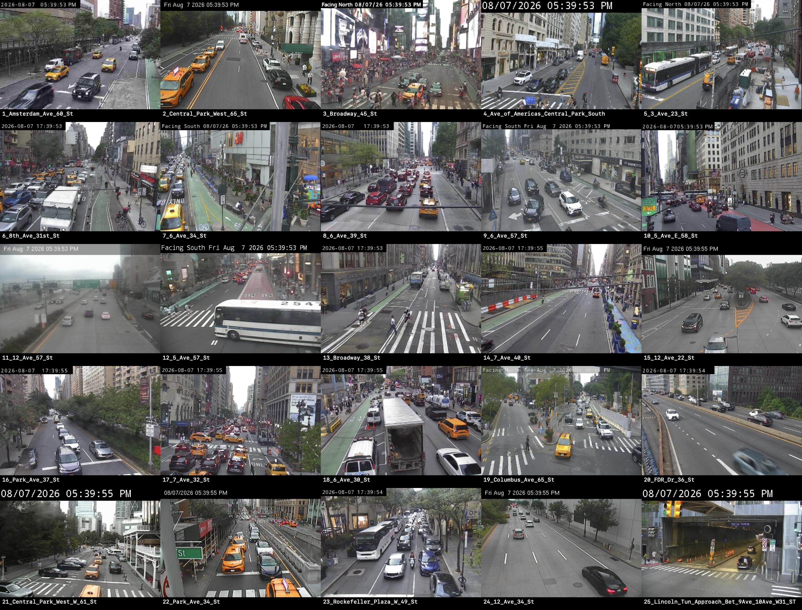
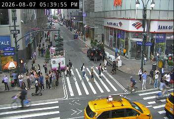
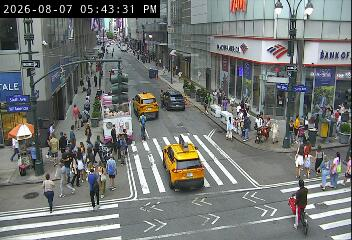
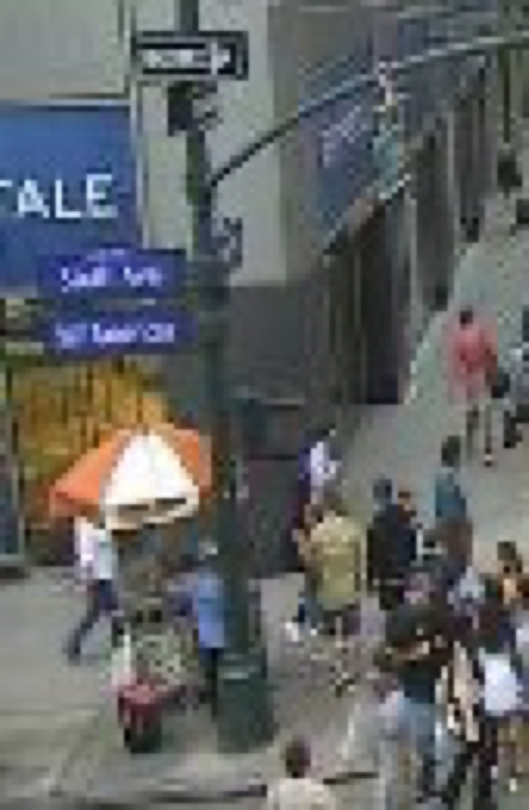
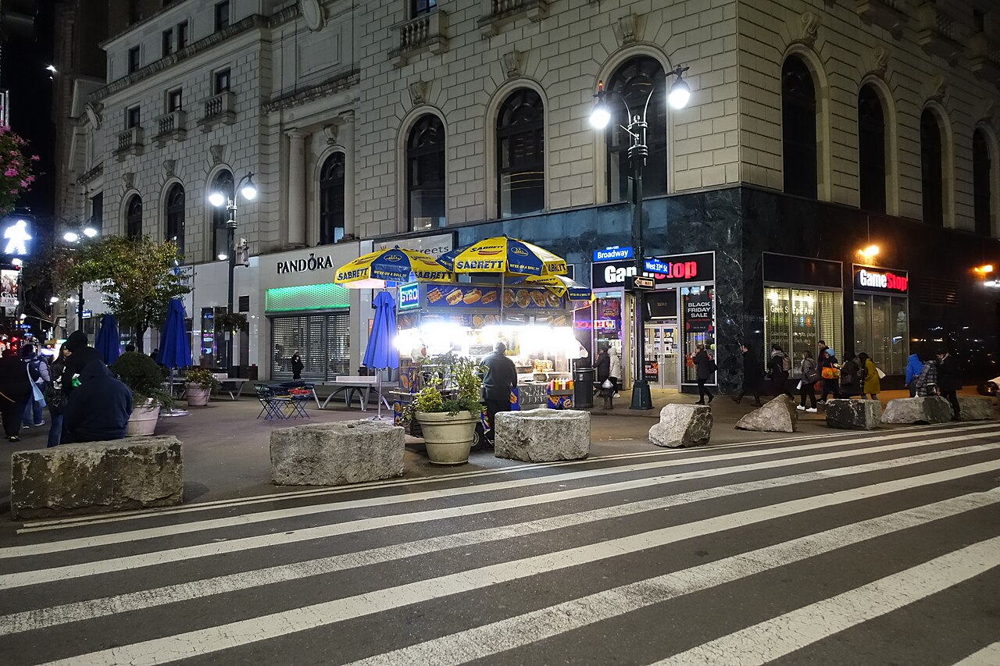

# Camera-first cart POC — Herald Square Sabrett stand

Run: August 7, 2026, 5:39–5:43 PM ET.

## Outcome

The camera-first flow works for a second cart. A scan of 100 live Manhattan DOT frames—performed before looking up cart names—flagged a stationary vending setup at the left edge of camera 39, `Broadway @ 6 Ave / 33 St`.

Post-detection research identified the best match as a **Sabrett hot dog stand at the Herald Square pedestrian plaza**. This is a brand-level identity; the individual proprietor's name is unknown.

Confidence:

- Food-cart presence: **high**
- Same physical stand/location as the historical reference: **high**
- Brand is Sabrett: **high**
- Individual operator identity: **unknown**
- Exact Google Maps listing exists: **no result found**

## Step 1 — camera-only discovery

The agent downloaded 100 live DOT images covering Manhattan and created a contact sheet. Candidate 39 was selected visually because it contains a stationary commercial umbrella and cart body on the pedestrian plaza.



Camera metadata:

- Name: `Broadway @ 6 Ave / 33 St`
- ID: `8ee72946-49e0-4f49-991d-4f52b1206ed7`
- Coordinate: `40.749412, -73.988060`
- [Live DOT image](https://webcams.nyctmc.org/api/cameras/8ee72946-49e0-4f49-991d-4f52b1206ed7/image)
- [DOT camera map](https://webcams.nyctmc.org/map)

Initial live frame:



Second live frame, four minutes later:



The cart persists across both frames while cars and pedestrians change, ruling out a transient vehicle/object.



## Step 2 — agentic identity search

Only after detection, the agent searched the intersection and appearance. The strongest independent match was a geotagged Wikimedia Commons photo titled **“Sabrett Hot Dog Stand, Herald Square Pedestrian Plaza, 6th Avenue and 33rd Street.”**

- Historical photo date: November 13, 2022
- Photo coordinate: `40.749300, -73.988000`
- Distance from DOT camera coordinate: **13.4 m**
- Visual signals: same Sabrett yellow/blue umbrella family, same plaza edge, same street crossing, same building frontage
- [Wikimedia source and metadata](https://commons.wikimedia.org/wiki/File:Herald_Square_td_(2022-11-13)_006_-_Pedestrian_Plaza.jpg)



The reference image is CC BY-SA 4.0 and should be attributed if included in a public demo.

## Step 3 — Chrome/Maps verification

The exact query `Sabrett Hot Dog Stand Herald Square 33rd Street Broadway` was tested in the authenticated Google Maps session.

[Repeat the Maps query](https://www.google.com/maps/search/?api=1&query=Sabrett%20Hot%20Dog%20Stand%20Herald%20Square%2033rd%20Street%20Broadway)

Maps returned only partial matches for “Broadway” and an unrelated “33rd St” in Queens. The result panel ended with **“Should this place be on Google Maps? Add a missing place.”** No exact stand listing appeared.

## POC observation record

```json
{
  "observation_id": "dot-8ee72946-2026-08-07T17:43:31-04:00",
  "source": "nyc_dot_camera",
  "camera_id": "8ee72946-49e0-4f49-991d-4f52b1206ed7",
  "camera_name": "Broadway @ 6 Ave / 33 St",
  "observed_at": "2026-08-07T17:43:31-04:00",
  "presence": {
    "class": "food_cart",
    "status": "present",
    "confidence": "high",
    "persistence_frames": 2,
    "persistence_window_minutes": 4
  },
  "resolved_entity": {
    "display_name": "Sabrett Hot Dog Stand — Herald Square",
    "identity_level": "brand",
    "operator_name": null,
    "latitude": 40.749300,
    "longitude": -73.988000,
    "distance_from_camera_m": 13.4,
    "confidence": "high"
  },
  "validators": [
    "geotagged_reference_photo",
    "visual_brand_match",
    "multi_frame_persistence",
    "google_maps_negative_lookup"
  ],
  "maps_status": "missing_exact_listing",
  "database_action": "append_presence_observation"
}
```

## What the camera contributes

The registry answers **“what has been reported here?”** The camera answers **“is it physically here now?”** Those are different products.

Useful camera-derived fields:

- currently present / absent / uncertain;
- first seen and last seen today;
- usual operating schedule learned from repeated observations;
- relocation candidate when a known cart disappears from one camera and appears at another;
- line length or approximate busyness;
- visual-change alert when color, branding, or vehicle geometry changes.

The database should be append-only for observations. A single frame should never overwrite a cart's canonical location. Promote a location change only after multiple temporal observations and at least one independent identity validator.

## Recommended agent loop

1. Poll selected DOT frames every 1–5 minutes.
2. Detect `food cart`, `food truck`, `umbrella + vending body`, and persistent sidewalk objects.
3. Track detections across frames to suppress taxis, buses, construction equipment, and temporary umbrellas.
4. Convert the image region to a small candidate street polygon using per-camera calibration.
5. Search the internal cart database only after detection.
6. If unmatched or ambiguous, run the Chrome research agent: Maps, web/image search, recent social posts, official website, and historical/geotagged photos.
7. Store a new observation with evidence and confidence. Never silently overwrite identity or location.
8. Send ambiguous identity changes to a human/community confirmation queue.

## Product conclusion

The winning framing is not “a bigger static halal-cart registry.” It is a **live cart-presence and change-detection layer** that can enrich any registry. A strong demo screen would say:

> Seen now at Herald Square · likely Sabrett stand · confirmed across 2 live frames · 13 m historical geo-match · no exact Google Maps listing.
