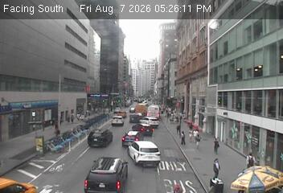
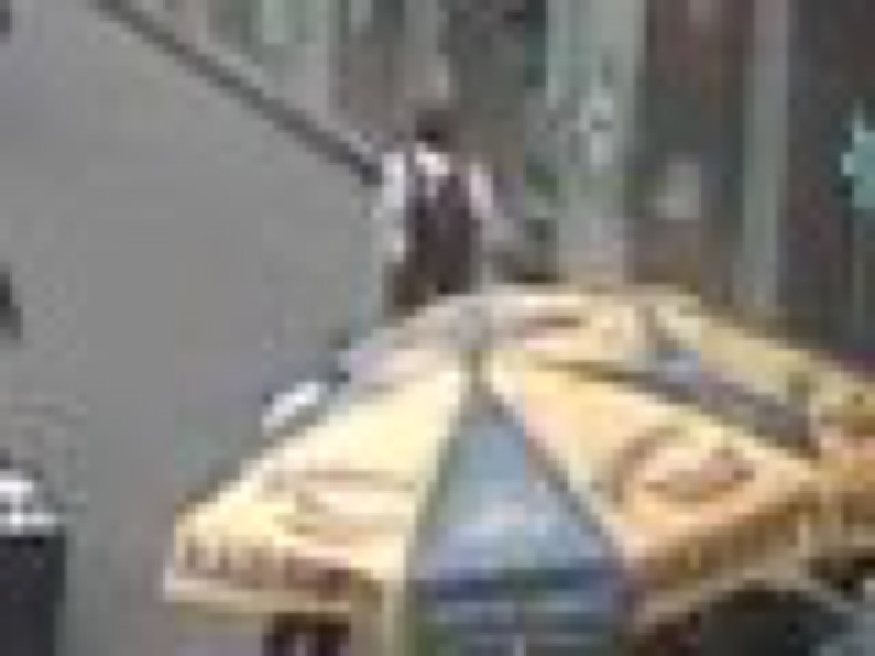
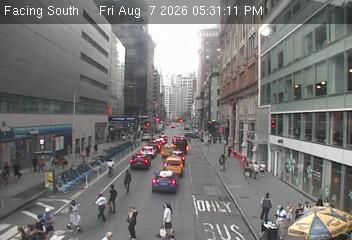
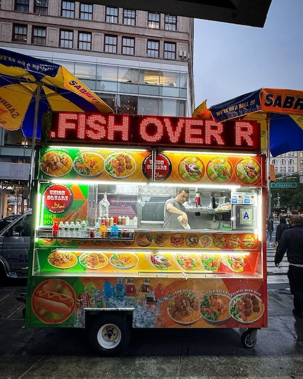

# Cart vision feasibility test — Union Square

Test run: August 7, 2026, approximately 5:26–5:31 PM ET.

## Result

This is a viable hackathon concept, with one important distinction: the live DOT feed can establish **cart presence**, while identity should be produced by combining location, visual similarity, and community records—not by pretending low-resolution OCR is conclusive.

Best current match: **Union Square Halal Food**, southeast corner of 14th Street and Broadway.

Confidence:

- A food-cart setup is present: **high**. The same commercial yellow/blue Sabrett umbrella is visible in two DOT frames five minutes apart.
- The cart is the community-listed “Union Square Halal Food”: **medium**. The DOT camera is 19.3 m from the registry coordinate, the corner agrees, and the reference photo has the same umbrella family and a visible Broadway street sign. The live frame does not expose enough of the cart for reliable OCR.
- It is absent from Google Maps at that exact identity/location: **strong negative-search evidence, not a universal proof**. The exact-name query returns different nearby carts; the exact coordinate resolves to an unnamed plus-code card offering “Add a missing place.”

## Evidence

### 1. Live DOT observation

Camera: `Union Sq @ 14 St`
Camera ID: `d47d2f63-cdc1-4f28-bc4c-e64ac07e4f1d`
DOT coordinate: `40.73483, -73.99087`
[Live image endpoint](https://webcams.nyctmc.org/api/cameras/d47d2f63-cdc1-4f28-bc4c-e64ac07e4f1d/image) · [DOT camera map](https://webcams.nyctmc.org/map)

A second frame at 5:31 PM shows the same umbrella in the same position:

### 2. Independent name and location validator

The community halal-cart guide Over Rice lists **Union Square Halal Food** at **14th Street and Broadway, southeast corner**, coordinate `40.734717, -73.9906964`. Its gallery photo is truck image 33.

[Over Rice gallery](https://www.overrice.nyc/gallery) · [Original reference photo](https://f005.backblazeb2.com/file/over-rice-public-assets/truck/sm/33.jpeg)

The registry coordinate is **19.3 m** from the DOT camera coordinate. The photo shows the Broadway sign and yellow/blue Sabrett umbrellas consistent with the live corner observation. Umbrella branding is not unique, so this is a shortlist/matching signal rather than a sole identifier.

### 3. Google Maps negative lookup

Tests performed in the authenticated Chrome session:

1. Exact-name-and-corner query: `Union Square Halal Food 14th Street Broadway New York`.
2. Exact registry coordinate query: `40.734717, -73.9906964`.

[Repeat the name query](https://www.google.com/maps/search/?api=1&query=Union%20Square%20Halal%20Food%2014th%20Street%20Broadway%20New%20York) · [Open the exact coordinate](https://www.google.com/maps/search/?api=1&query=40.734717%2C-73.9906964)

The name query returned other listings, including:

- “14 Street Halal Food” at `40.7344694, -73.9895852` — **97.6 m** from the candidate.
- “100 Percent Halal Food” at `40.7348246, -73.9897602` — **79.8 m** away.
- “The Halal Kitchen” at `40.7350951, -73.9919658` — **114.9 m** away and visually associated with a different red/yellow umbrella setup in the community guide.

No exact “Union Square Halal Food” result appeared. At the candidate coordinate, Maps displayed only the coordinates/plus code and an **“Add a missing place”** action.

## Permit-data finding

NYC requires both a mobile food vending unit permit and a vendor license, but the public permit/licensing information is not a dependable live-location identity layer. It establishes legal requirements for a person/unit; it does not give us a canonical real-time corner assignment for each cart.

[NYC Mobile Food Vending Unit Permit](https://nyc-business.nyc.gov/nycbusiness/description/mobile-food-vending-unit-permit-full-term) · [NYC Mobile Food Vending License](https://nyc-business.nyc.gov/nycbusiness/description/mobile-food-vending-license)

## What this proves—and what it does not

It proves the core product loop is plausible:

`DOT frame → cart-presence detection → geospatial shortlist → reference-image/community match → Maps gap flag`

It does **not** prove the live pixels alone can read the cart's name. These DOT images are only 352×240, and the cart is partly outside the frame. OCR should be an optional confidence boost. The winning implementation should score multiple signals and show its evidence transparently.

## Best hackathon demo

Build a “Ghost Carts” map. Each pin gets an evidence card with:

- current/live camera frame and detected cart crop;
- likely name, corner, and confidence score;
- community reference photo and last confirmation;
- Google Maps status: exact match, ambiguous nearby match, or missing;
- a one-tap community confirm/correct action.

For this candidate, the card would read: **Seen now · likely Union Square Halal Food · 19 m geo match · visual umbrella match · missing at exact Maps coordinate · identity confidence: medium.**
